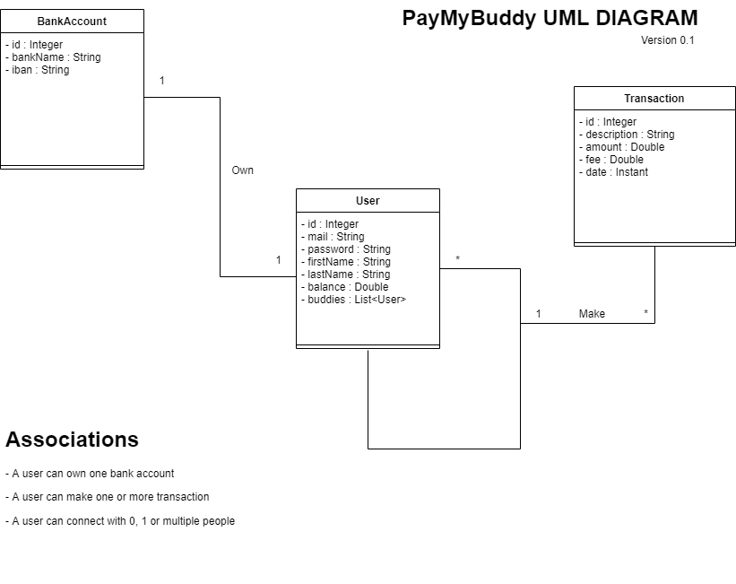
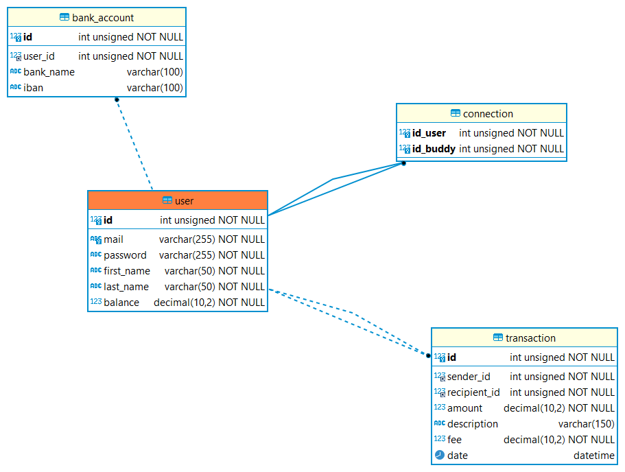

# Pay My Buddy
Pay My Buddy is a web application that allows users to transfer money to others users, called "buddies".
**The technical stack of this application consist of** :
- Java and Spring Boot Framework for the back-end logic
- Thymeleaf and Boostrap v5.2 for the front-end design
- MySQL for the database management system

 

## UML Class Diagram

## Physical Data Model

## Creating the database
In order to get started, you need to follow these steps :
1. Create a new database called `paymybuddy`
2. Import the `schema.sql` file (in the main/resources folder) to create the table
3. (Optional) Import the `data.sql` in your newly created database to have a set of data and try the application directly.

## Externalized MySQL configuration
(When implemented, explain how to connect the application to the database with the settings.xml file)

## Application.properties
You can custom the application by editing the `application.properties` file in the main/resources folder.
1. `server.port= [number]` : sets the local port of the web application
2. `transactions.itemsPerPages = [number]` : sets the number of transactions per pages shown on the homepage
