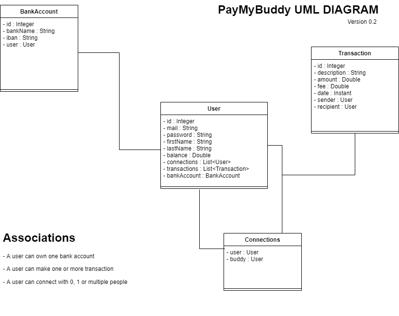

# Pay My Buddy
Pay My Buddy is a web application that allows users to transfer money to others users, called "buddies".
**The technical stack of this application consist of** :
- Java and Spring Boot Framework for the back-end logic
- Thymeleaf and Boostrap v5.2 for the front-end design
- MySQL for the database management system

 

## UML Class Diagram

## Physical Data Model

## Creating the database
In order to get started, you need to follow these steps :
1. Create a new database called `paymybuddy` with the following command : `CREATE DATABASE paymybuddy;`
2. Import the `schema.sql` file (in the main/resources folder) to create the tables
3. (Optional) Import the `datas.sql` in your newly created database to have a set of data and try the application directly (*refer to 'Demo of Application' section for more information*)

There are no sequences to import, because MySQL manages it itself by using the AUTO_INCREMENT attribute.

## Externalized MySQL configuration
For security purposes, the database credentials are externalized from the project. In order to make the database works, you must create a `jdbc.properties` file on your computer.
  **In the main/resources folder, there is an empty jdbc.properties file that you can use.**
  When the file is created you must edit `application.properties` property `spring.config.import` and set your own path.
  The application should start correctly if everything is set up properly.

## Application.properties
You can custom the application by editing the `application.properties` file in the main/resources folder.
1. `server.port= [number]` : sets the local port of the web application
2. `transactions.itemsPerPages = [number]` : sets the number of transactions per pages shown on the homepage

<<<<<<< HEAD
## Starting the application
In the root folder, open a command prompt (**cmd.exe**) and type the following command to start the application : `mvn spring-boot:run`
If the database was properly setup, the application should start.  
The url is [http://localhost:8080](http://localhost:8080)

=======
>>>>>>> 9a17f03a4bf1d0a71367f624cf818188aee47c95
## Demo of the application
**Import the `datas.sql` file (in the main/resources folder) to import demonstration datas**
There are 3 users, with pre-filled fields. The main account is the number 1, from there you will be able to see transactions, bank account and connections
The 2 others users are used as "buddies" and don't have everything filled
1. Stéphane Robert (s.robert@localhost.fr:password), connected to user 2 and 3
2. Alice Vaillancour (a.vaillancour@localhost.fr:password), connected to user 1
3. Leo Luzzi (l.luzzi@localhost.fr:password), connected to user 1